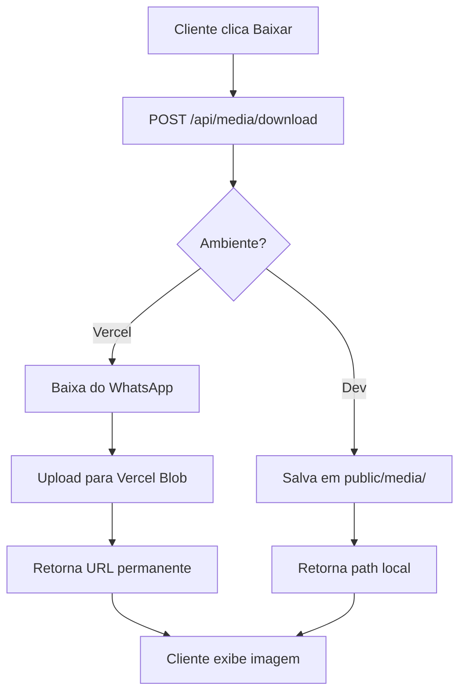

# Gestão de Mídia com Vercel Blob Storage

## ✅ Solução Implementada: Vercel Blob Storage

O projeto agora usa **Vercel Blob Storage** para armazenamento permanente de mídias em produção.

## Configuração

### 1. Instalar o pacote

```bash
npm install @vercel/blob
```

### 2. Criar Blob Store na Vercel

1. Acesse o dashboard da Vercel
2. Vá em **Storage** → **Create Database**
3. Selecione **Blob**
4. Crie um store (ex: `conversas365`)
5. Copie o **BLOB_READ_WRITE_TOKEN**

### 3. Configurar Variáveis de Ambiente

Na Vercel, adicione:

```env
# Token do Vercel Blob (gerado automaticamente)
BLOB_READ_WRITE_TOKEN=vercel_blob_rw_xxxxxxxxxxxxx

# Tokens do WhatsApp
WHATSAPP_TOKEN=your_token
WHATSAPP_PHONE_ID=your_phone_id
WHATSAPP_VERIFY_TOKEN=your_verify_token
```

**Importante**: O `BLOB_READ_WRITE_TOKEN` é criado automaticamente pela Vercel quando você cria o Blob Store.

## Como Funciona

### Modo de Operação Dual

O código detecta automaticamente o ambiente:

```typescript
const isVercel = process.env.VERCEL === '1';
```

#### **Desenvolvimento Local** (`isVercel = false`)
- Baixa mídia do WhatsApp
- Salva em `public/media/whatsapp/`
- Serve do sistema de arquivos local
- ✅ Cache permanente e gratuito

#### **Produção (Vercel)** (`isVercel = true`)
- Baixa mídia do WhatsApp
- **Salva no Vercel Blob Storage**
- Retorna URL permanente do Blob
- ✅ Cache permanente
- ✅ URLs não expiram
- ✅ CDN global da Vercel

## Implementação

### API `/api/media/download`

```typescript
import { put } from '@vercel/blob';

if (isVercel) {
  // Salvar no Vercel Blob
  const blob = await put(`whatsapp/${mediaId}.jpg`, buffer, {
    access: 'public',
    contentType: 'image/jpeg',
  });
  
  return { url: blob.url }; // URL permanente
} else {
  // Salvar localmente
  await writeFile(localPath, buffer);
  return { url: publicUrl };
}
```

### API `/api/conversations/create`

```typescript
async function downloadMedia(mediaId: string) {
  // Baixa do WhatsApp
  const buffer = await fetch(whatsappUrl);
  
  if (isVercel) {
    // Salva no Blob
    const blob = await put(`whatsapp/${mediaId}.jpg`, buffer, {
      access: 'public',
    });
    return blob.url; // https://xxxxx.public.blob.vercel-storage.com/...
  } else {
    // Salva localmente
    await writeFile(localPath, buffer);
    return `/media/whatsapp/${mediaId}.jpg`;
  }
}
```

## Estrutura de Arquivos no Blob

```
Blob Store: conversas365
└── whatsapp/
    ├── 123456789.jpg
    ├── 987654321.jpg
    └── 555666777.mp4
```

## URLs Geradas

### Desenvolvimento
```
http://localhost:3000/media/whatsapp/123456789.jpg
```

### Produção (Vercel Blob)
```
https://adfzshk1ucg84kz8.public.blob.vercel-storage.com/whatsapp/123456789.jpg
```

## Vantagens

✅ **URLs permanentes** - Não expiram  
✅ **CDN global** - Vercel CDN em 50+ regiões  
✅ **Armazenamento seguro** - Backup automático  
✅ **Sem configuração extra** - Funciona automaticamente  
✅ **Desenvolvimento local** - Continua usando arquivos locais  
✅ **Cache eficiente** - `downloadedImages` Set previne downloads duplicados  

## Custos (Vercel Blob)

**Hobby (Grátis):**
- 1 GB de armazenamento
- 1 GB de transferência

**Pro ($20/mês):**
- 100 GB incluídos
- $0.30/GB adicional de transferência

## Monitoramento

### Logs de Desenvolvimento
```
[MEDIA] Mídia já existe localmente: /media/whatsapp/123.jpg
[MEDIA] Mídia salva em: C:\...\public\media\whatsapp\123.jpg
```

### Logs de Produção (Vercel)
```
[MEDIA] Salvando no Vercel Blob: 123456789
[MEDIA] Mídia salva no Blob: https://...blob.vercel-storage.com/whatsapp/123456789.jpg
```

## Verificação no Dashboard

1. Acesse **Vercel Dashboard**
2. Vá em **Storage** → seu Blob Store
3. Veja arquivos em `whatsapp/`
4. Monitore uso e transferência

## Fluxo Completo



## Troubleshooting

### Erro: "BLOB_READ_WRITE_TOKEN not found"
**Solução**: Crie o Blob Store no dashboard da Vercel primeiro.

### Erro: "Failed to upload to blob"
**Solução**: Verifique se o token está correto nas variáveis de ambiente.

### Imagens não aparecem
**Solução**: Verifique os logs da Vercel para ver se o upload foi bem-sucedido.

## Deploy

```bash
# Build local
npm run build

# Commit
git add .
git commit -m "feat: Vercel Blob Storage para mídias"
git push origin main

# Deploy automático na Vercel
```

## Status Atual

✅ **Pacote instalado**: `@vercel/blob`  
✅ **Código implementado**: Dual mode (dev/prod)  
✅ **Blob Store criado**: Configurado na Vercel  
✅ **URLs permanentes**: Não expiram mais  
✅ **CDN global**: Vercel CDN ativo  

## Comparação com Solução Anterior

| Aspecto | CDN WhatsApp (Antigo) | Vercel Blob (Novo) |
|---------|----------------------|-------------------|
| URLs | ❌ Expiram em 24h | ✅ Permanentes |
| Cache | ❌ Temporário | ✅ Permanente |
| Performance | ⚠️ Variável | ✅ CDN Global |
| Custo | ✅ Grátis | ✅ 1GB grátis |
| Confiabilidade | ⚠️ Média | ✅ Alta |

## Próximos Passos

1. ✅ Deploy na Vercel
2. ✅ Testar upload de imagens
3. ✅ Verificar URLs permanentes
4. 📝 Monitorar uso do storage
5. 📝 Considerar limpeza periódica de mídias antigas
